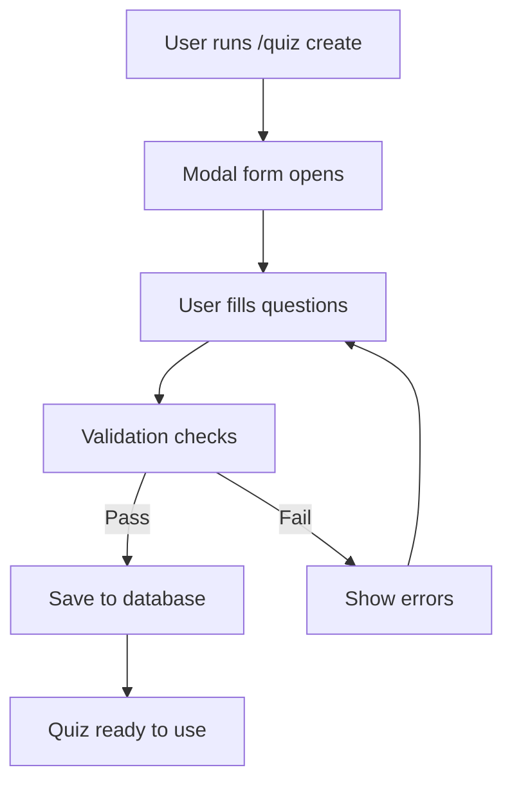
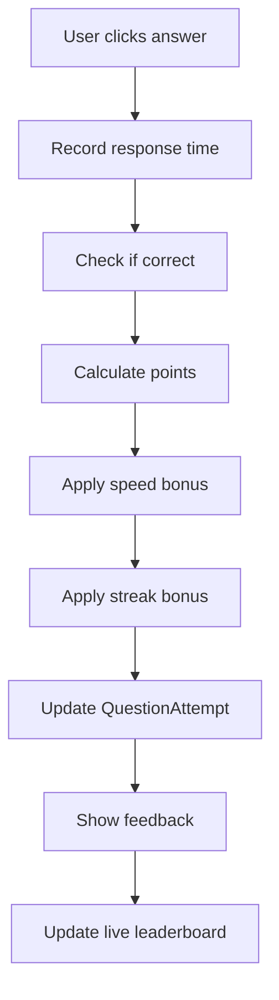

# Architecture

Quiz Unlocked is built with a modern, scalable architecture designed for reliability, maintainability, and extensibility. This guide provides an in-depth look at the technical stack, design patterns, and system architecture.

## Technology Stack

### Core Technologies

**Runtime & Language**

- **Node.js 18+** - JavaScript runtime with modern ES modules support
- **TypeScript 5.x** - Type-safe development with strict mode enabled
- **Discord.js v14** - Latest Discord API wrapper with full interaction support

**Database & ORM**

- **PostgreSQL** - Reliable, scalable relational database
- **Prisma ORM** - Type-safe database client with automatic migrations
- **Connection pooling** - Efficient database connection management

**Development & Quality**

- **Vitest** - Fast unit and integration testing framework
- **ESLint** - Code linting with TypeScript-specific rules
- **Prettier** - Consistent code formatting
- **Husky** - Git hooks for pre-commit validation

### Key Dependencies

```json
{
  "discord.js": "^14.x",
  "@prisma/client": "^5.x",
  "typescript": "^5.x",
  "vitest": "^1.x",
  "csv-parse": "^5.x",
  "dotenv": "^16.x"
}
```

## Project Structure

```
quiz-unlocked/
├── app/                    # Application source code
│   ├── commands/          # Slash command handlers
│   │   ├── admin/         # Administrative commands
│   │   ├── botowner/      # Bot owner-only commands
│   │   ├── corpus/        # Question bank management
│   │   ├── image/         # Image upload/management
│   │   ├── leaderboard/   # Rankings and statistics
│   │   ├── quiz/          # Quiz creation and management
│   │   ├── question/      # Individual question operations
│   │   ├── stats/         # Performance statistics
│   │   └── user/          # User-specific operations
│   ├── events/            # Discord event handlers
│   │   ├── ready.ts       # Bot initialization
│   │   ├── interactionCreate.ts  # Interaction routing
│   │   └── imageButtonHandlers.ts  # Image interaction logic
│   ├── services/          # Business logic layer
│   │   ├── QuizService.ts     # Core quiz functionality
│   │   ├── DatabaseService.ts  # Database abstraction
│   │   ├── LeaderboardService.ts  # Statistics and rankings
│   │   └── ButtonCleanupService.ts  # UI component lifecycle
│   ├── types/             # TypeScript definitions
│   │   └── index.ts       # Shared interfaces and types
│   ├── utils/             # Utility functions
│   │   ├── config.ts      # Configuration management
│   │   ├── logger.ts      # Logging utilities
│   │   ├── permissions.ts # Permission checking
│   │   └── arrayUtils.ts  # Array manipulation helpers
│   └── index.ts           # Application entry point
├── prisma/                # Database schema and migrations
│   ├── schema.prisma      # Database schema definition
│   └── migrations/        # Database migration files
├── tests/                 # Test suites
│   ├── commands/          # Command testing
│   ├── services/          # Service layer testing
│   ├── integration/       # End-to-end testing
│   └── utils/             # Utility function testing
├── docs/                  # Documentation (VitePress)
├── data/                  # Static data files
├── public/                # Public assets
└── scripts/               # Build and deployment scripts
```

## Database Schema

Quiz Unlocked uses a carefully designed relational schema optimized for performance and flexibility.

### Core Entities

#### User

Represents Discord users who interact with the bot.

```prisma
model User {
  id        String   @id            // Discord user ID
  username  String                  // Current Discord username
  createdAt DateTime @default(now())
  
  // Relations
  quizAttempts QuizAttempt[]  // All quiz sessions by this user
  scores       Score[]        // Aggregated performance data
  ownedQuizzes Quiz[]         // Quizzes created by this user
  images       Image[]        // Images uploaded by this user
}
```

#### Quiz

Contains quiz metadata and configuration.

```prisma
model Quiz {
  id          String   @id @default(cuid())
  title       String                    // Quiz display name
  description String?                   // Optional description
  isActive    Boolean  @default(true)   // Can this quiz be started?
  timeLimit   Int?                      // Total quiz time limit (seconds)
  private     Boolean  @default(false)  // Visibility control
  quizOwnerId String?                   // Creator user ID
  createdAt   DateTime @default(now())
  
  // Relations
  quizOwner   User?         @relation(fields: [quizOwnerId], references: [id])
  questions   Question[]    // All questions in this quiz
  attempts    QuizAttempt[] // All attempts of this quiz
}
```

#### Question

Individual quiz questions with metadata.

```prisma
model Question {
  id           String   @id @default(cuid())
  quizId       String                   // Parent quiz
  questionText String                   // The question content
  options      String                   // JSON array: ["A", "B", "C", "D"]
  correctAnswer Int                     // 0-based index of correct option
  points       Int      @default(10)    // Points awarded for correct answer
  timeLimit    Int?                     // Question-specific time limit
  imageId      String?                  // Optional image attachment
  
  // Relations
  quiz     Quiz     @relation(fields: [quizId], references: [id])
  image    Image?   @relation(fields: [imageId], references: [id])
  attempts QuestionAttempt[] // All attempts of this question
  hints    Hint[]            // Optional hints for this question
}
```

### Quiz Session Management

#### QuizAttempt

Tracks individual quiz sessions.

```prisma
model QuizAttempt {
  id          String    @id @default(cuid())
  userId      String                      // User taking the quiz
  quizId      String                      // Quiz being attempted
  startedAt   DateTime  @default(now())
  completedAt DateTime?                   // When quiz finished (null = ongoing)
  totalScore  Int       @default(0)       // Final score for this attempt
  totalTime   Int?                        // Total completion time (seconds)
  
  // Relations
  user             User              @relation(fields: [userId], references: [id])
  quiz             Quiz              @relation(fields: [quizId], references: [id])
  questionAttempts QuestionAttempt[] // Individual question responses
}
```

#### QuestionAttempt  

Tracks responses to individual questions.

```prisma
model QuestionAttempt {
  id                String    @id @default(cuid())
  quizAttemptId     String                        // Parent quiz session
  questionId        String                        // Question being answered
  questionStartedAt DateTime?                     // When question was shown
  selectedAnswer    Int?                          // User's selected option (0-based)
  isCorrect         Boolean?                      // Whether answer was correct
  timeSpent         Int?                          // Response time (seconds)
  pointsEarned      Int       @default(0)         // Points awarded (includes bonuses)
  answeredAt        DateTime  @default(now())
  wasFastestCorrect Boolean?                      // Speed bonus eligibility
  answerRank        Int?                          // Order of response (1st, 2nd, etc.)
  
  // Relations
  quizAttempt QuizAttempt @relation(fields: [quizAttemptId], references: [id])
  question    Question    @relation(fields: [questionId], references: [id])
}
```

### Performance Tracking

#### Score

Aggregated performance data for leaderboards.

```prisma
model Score {
  id           String  @id @default(cuid())
  userId       String                    // User this score belongs to
  period       String                    // "weekly", "monthly", "yearly", "overall"
  year         Int                       // Score year
  week         Int?                      // Week number (for weekly scores)
  month        Int?                      // Month number (for monthly scores)
  totalScore   Int     @default(0)       // Cumulative points
  totalQuizzes Int     @default(0)       // Number of quizzes completed
  averageScore Float   @default(0)       // Mean score per quiz
  bestTime     Int?                      // Fastest completion time
  
  // Relations
  user User @relation(fields: [userId], references: [id])
  
  // Constraints
  @@unique([userId, period, year, week, month])
}
```

### Content Management

#### Corpus

Question banks for generating randomized quizzes.

```prisma
model Corpus {
  id        String   @id @default(cuid())
  title     String   @unique           // Corpus display name
  createdAt DateTime @default(now())
  
  // Relations
  entries CorpusEntry[] // All question variants in this corpus
}
```

#### CorpusEntry

Individual entries in a question bank with variants.

```prisma
model CorpusEntry {
  id               String   @id @default(cuid())
  corpusId         String                 // Parent corpus
  tags             String[]               // Categorization tags
  questionVariants String[]               // Multiple question phrasings
  answerVariants   String[]               // Multiple correct answers
  hintTitles       String[]               // Hint button labels
  hintVariants     Json                   // Structured hint content
  
  // Relations
  corpus Corpus @relation(fields: [corpusId], references: [id])
}
```

#### Image & Hint

Supporting content for rich questions.

```prisma
model Image {
  id         String   @id @default(cuid())
  userId     String                   // Uploader
  path       String                   // File system path
  title      String?                  // Display name
  altText    String?                  // Accessibility text
  uploadedAt DateTime @default(now())
  
  // Relations
  user      User       @relation(fields: [userId], references: [id])
  questions Question[] // Questions using this image
}

model Hint {
  id         String   @id @default(cuid())
  questionId String                   // Parent question
  title      String                   // Button label ("Hint", "Formula", etc.)
  text       String                   // Hint content
  createdAt  DateTime @default(now())
  
  // Relations
  question Question @relation(fields: [questionId], references: [id])
}
```

## Service Layer Architecture

Quiz Unlocked follows a service-oriented architecture with clear separation of concerns.

### QuizService

The core business logic service managing quiz sessions and gameplay.

**Key Responsibilities:**

- Quiz session lifecycle management
- Real-time participant coordination
- Score calculation with bonuses and multipliers
- Interactive Discord UI management
- Question flow and timing control

**Design Patterns:**

- **Singleton**: Single instance manages all active sessions
- **State Machine**: Each quiz session has defined states (waiting, active, completed)
- **Observer**: Real-time updates to all participants
- **Command**: User interactions processed as commands

```typescript
class QuizService {
  // Session state management
  private activeQuizzes = new Map<string, QuizSession>();
  
  // Core operations
  public async startQuiz(channelId: string, quizId: string): Promise<void>
  public async stopQuiz(channelId: string): Promise<void>
  public async handleAnswer(interaction: ButtonInteraction): Promise<void>
  public async nextQuestion(channelId: string): Promise<void>
  
  // Scoring and analytics
  private calculateScore(basePoints: number, responseTime: number): number
  private updateLeaderboards(attempt: QuizAttempt): Promise<void>
}
```

### DatabaseService

Abstraction layer for all database operations using Prisma.

**Key Responsibilities:**

- Connection pool management
- Transaction handling
- Query optimization
- Error handling and retry logic
- Database health monitoring

```typescript
class DatabaseService {
  public readonly prisma: PrismaClient;
  
  // Connection management
  public async connect(): Promise<void>
  public async disconnect(): Promise<void>
  public async healthCheck(): Promise<DatabaseHealth>
  
  // Transaction support
  public async transaction<T>(fn: (tx: PrismaClient) => Promise<T>): Promise<T>
}
```

### LeaderboardService

Manages performance tracking and ranking calculations.

**Key Responsibilities:**

- Real-time leaderboard updates
- Multi-period score aggregation (weekly/monthly/yearly)
- User statistics calculation
- Rank computation with tie-breaking
- Performance analytics

```typescript
class LeaderboardService {
  // Leaderboard operations
  public async getLeaderboard(period: LeaderboardPeriod): Promise<LeaderboardEntry[]>
  public async updateScore(userId: string, score: number): Promise<void>
  public async getUserStats(userId: string): Promise<UserStats | null>
  
  // Analytics
  private calculateSuccessRate(userId: string): Promise<number>
  private updateRankings(period: LeaderboardPeriod): Promise<void>
}
```

### ButtonCleanupService

Manages Discord component lifecycle to prevent memory leaks.

**Key Responsibilities:**

- Automatic cleanup of expired Discord buttons
- Component state tracking
- Memory management for long-running sessions
- UI consistency maintenance

## Event-Driven Architecture

Quiz Unlocked uses Discord.js's event system for responsive interaction handling.

### Event Flow

1. **Startup** (`ready` event)
   - Initialize services
   - Deploy slash commands
   - Restore session state

2. **Command Interaction** (`interactionCreate`)
   - Route to appropriate command handler
   - Validate permissions and parameters
   - Execute business logic
   - Return response to user

3. **Button Interaction** (custom routing)
   - Parse button custom IDs
   - Route to quiz answer handlers
   - Update quiz state in real-time
   - Broadcast updates to participants

4. **Background Tasks** (timers and cleanup)
   - Session timeout handling
   - Component cleanup
   - Leaderboard recalculation
   - Database maintenance

### Interaction Routing

```typescript
// Custom ID format: action_context_parameters
// Examples:
// "quiz_answer_abc123_1" - Answer option 1 for quiz abc123
// "hint_show_def456_0" - Show hint for question def456

const [action, context, ...params] = interaction.customId.split('_');

switch (action) {
  case 'quiz': return handleQuizInteraction(interaction, context, params);
  case 'hint': return handleHintInteraction(interaction, context, params);
  case 'admin': return handleAdminInteraction(interaction, context, params);
}
```

## Quiz Lifecycle

Understanding the complete flow of a quiz session:

### 1. Quiz Creation



### 2. Quiz Session

```mermaid
graph TD
    A[/quiz start command] --> B[Load quiz data]
    B --> C[Create QuizAttempt record]
    C --> D[Show first question]
    D --> E[Wait for answers]
    E --> F[Process responses]
    F --> G[Calculate scores]
    G -->|More questions| H[Show next question]
    G -->|Quiz complete| I[Show final results]
    H --> E
    I --> J[Update leaderboards]
```

### 3. Answer Processing



## Performance Considerations

### Database Optimization

**Indexing Strategy:**

- Primary keys on all tables
- Foreign key indexes for joins
- Composite indexes for leaderboard queries
- Partial indexes for active quizzes

**Query Optimization:**

- Batch operations for bulk updates
- Connection pooling for concurrent sessions
- Prepared statements for repeated queries
- Pagination for large result sets

### Memory Management

**Caching Strategy:**

- In-memory session state for active quizzes
- LRU cache for frequently accessed quiz data
- Component cleanup timers to prevent leaks
- Periodic garbage collection triggers

**Scalability Patterns:**

- Stateless command handlers
- Database-backed session persistence
- Horizontal scaling support
- Load balancing compatibility

### Real-time Performance

**Discord API Optimization:**

- Batch embed updates where possible
- Efficient button component management
- Rate limiting compliance
- Connection pooling for multiple servers

**Response Time Goals:**

- Command responses < 3 seconds
- Answer feedback < 1 second  
- Leaderboard updates < 2 seconds
- Quiz transitions < 2 seconds

## Security & Privacy

### Data Protection

**User Privacy:**

- Minimal data collection (Discord ID + username only)
- User-initiated data deletion support
- GDPR compliance features
- No message content storage

**Access Control:**

- Role-based command permissions
- Quiz ownership validation
- Server-specific data isolation
- Admin privilege checking

### Input Validation

**File Upload Security:**

- File type validation (CSV, images only)
- Size limits (25MB max)
- Content sanitization
- Virus scanning integration points

**Command Parameter Validation:**

- Type checking with TypeScript
- Range validation for numeric inputs
- SQL injection prevention (Prisma ORM)
- XSS prevention in embedded content

## Testing Strategy

Quiz Unlocked maintains high code quality through comprehensive testing:

### Test Categories

**Unit Tests** (`tests/services/`, `tests/utils/`)

- Individual function testing
- Service layer validation
- Utility function verification
- Edge case coverage

**Integration Tests** (`tests/integration/`)

- Database schema validation
- Service interaction testing
- Discord API integration
- End-to-end workflows

**Command Tests** (`tests/commands/`)

- Slash command handler validation
- Permission checking
- Error handling scenarios
- Response formatting

### Testing Tools

```typescript
// Example test structure
describe('QuizService', () => {
  it('should start a quiz session', async () => {
    // Arrange
    const mockQuiz = createMockQuiz();
    
    // Act
    await quizService.startQuiz('channel123', mockQuiz.id);
    
    // Assert
    expect(quizService.getActiveQuiz('channel123')).toBeDefined();
  });
});
```

## Deployment Architecture

Quiz Unlocked supports various deployment patterns:

### Single-Instance Deployment

- Simple VPS or cloud instance
- SQLite or PostgreSQL database
- Process manager (PM2, systemd)
- Reverse proxy (nginx) for web features

### Container Deployment

- Docker with multi-stage builds
- Docker Compose for development
- Kubernetes for production scaling
- Health checks and auto-restart

### Serverless Deployment  

- Cloud functions for command handlers
- Managed database (PlanetScale, Supabase)
- CDN for static assets
- Event-driven scaling

This architecture provides a solid foundation for both small community deployments and large-scale installations while maintaining code quality, performance, and extensibility.
